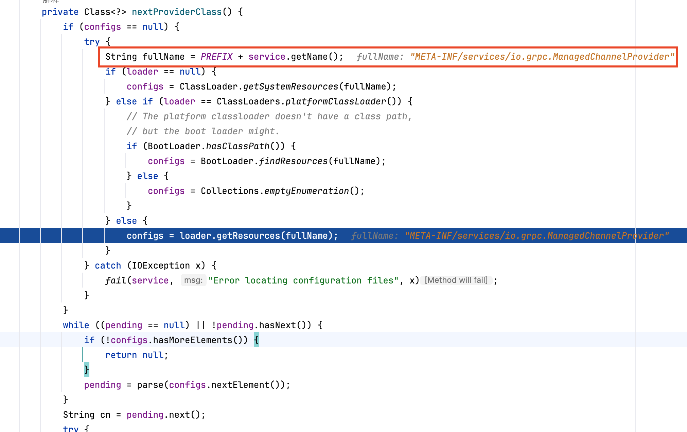

## 深入浅出 gRPC

gRPC(general-purpose RPC framework) ，它是开源高性能、通用的 RPC 框架，基于 HTTP/2 协议，使用 Protocol Buffers 作为接口描述语言和消息序列化格式。本篇文章以用 Java 编写 gRPC 接口为例，介绍 gRPC 相关的基本概念和使用方法：既可以简单地了解到 gRPC 的使用，也可以深入细节中熟悉更多相关的内容，代码示例参考 [grpc-java-example](https://github.com/FangYuan33/gRPC)。

> gRPC 最初由 Google 开发，大多数资料里会说 "g" 表示 "Google"，实际上它有 "g" 含义变化的小故事："g" 在最初确实代表 "Google"，后来随着 gRPC 开源并成为 CNCF（云原生计算基金会）的孵化项目，Google 有意淡化了品牌色彩，现在更多被理解为 "general-purpose RPC"，不再强调 Google 的部分，在官网的描述 "universal" 也更多体现它通用性的定位。

接下来我们通过一个简单的小例子来介绍下 gRPC 的用法：

### gRPC 怎么用？

通常情况下大家在定义 RPC 接口时，通常会创建 Java Interface 来定义接口签名（京东内部采用 JSF 框架，类似于 Dubbo），之后调用方通过这个 Interface 找到对应的服务便能调用 RPC 接口。而在 gRPC 中，它需要定义 `.proto` 文件来声明接口，我们来看一个简单的小例子：

```protobuf
syntax = "proto3";

option java_multiple_files = true;
option java_package = "com.grpc.helloworld";
option java_outer_classname = "HelloWorldProto";
option objc_class_prefix = "HLW";

package com.grpc.helloworld;

// 定义一个接口
service Greeter {
  // 接口中的方法
  rpc SayHello (HelloRequest) returns (HelloReply) {}
}

// 请求入参
message HelloRequest {
  string name = 1;
}

// 请求出参
message HelloReply {
  string message = 1;
}
```

在这个例子中，我们定义了一个名为 `Greeter` 的接口，它有一个名为 `SayHello` 的方法，该方法接受一个 `HelloRequest` 类型的参数，并返回一个 `HelloReply` 类型的响应。但是定义在 `.proto` 文件中的接口，并不能直接被调用，需要通过 gRPC 的代码生成工具来生成需要的语言的代码，这样才能供我们使用。那么该如何生成呢？

其实很简单，它提供了一个 Maven 编译的插件 `protobuf-maven-plugin` 能将 protobuf 编译成 Java 代码，执行 `mvn compile` 即可：

```xml
<dependencies>
    <dependency>
        <groupId>io.grpc</groupId>
        <artifactId>grpc-netty-shaded</artifactId>
        <version>1.75.0</version>
        <scope>runtime</scope>
    </dependency>
    <dependency>
        <groupId>io.grpc</groupId>
        <artifactId>grpc-protobuf</artifactId>
        <version>1.75.0</version>
    </dependency>
    <dependency>
        <groupId>io.grpc</groupId>
        <artifactId>grpc-stub</artifactId>
        <version>1.75.0</version>
    </dependency>
</dependencies>

<build>
    <extensions>
        <extension>
            <groupId>kr.motd.maven</groupId>
            <artifactId>os-maven-plugin</artifactId>
            <version>1.7.1</version>
        </extension>
    </extensions>
    <plugins>
        <plugin>
            <groupId>org.xolstice.maven.plugins</groupId>
            <artifactId>protobuf-maven-plugin</artifactId>
            <version>0.6.1</version>
            <configuration>
                <protocArtifact>com.google.protobuf:protoc:3.25.5:exe:${os.detected.classifier}</protocArtifact>
                <pluginId>grpc-java</pluginId>
                <pluginArtifact>io.grpc:protoc-gen-grpc-java:1.75.0:exe:${os.detected.classifier}</pluginArtifact>
            </configuration>
            <executions>
                <execution>
                    <goals>
                        <goal>compile</goal>
                        <goal>compile-custom</goal>
                    </goals>
                </execution>
            </executions>
        </plugin>
    </plugins>
</build>
```

经过编译后在 Output 输出路径下能看见它将接口定义编译成了类 `GreeterGrpc`，入参类型为 `HelloRequest`，出参类型为 `HelloReply`：


生成的这些类中都包含什么内容呢？首先让我们看看生成的入参类型 `HelloRequest`：

```java
public final class HelloRequest extends GeneratedMessageV3 implements HelloRequestOrBuilder {
    // ...    

    private volatile Object name_ = "";

    private HelloRequest() {
        this.name_ = "";
    }

    // 转换类型并获取字段值
    public String getName() {
        Object ref = this.name_;
        if (ref instanceof String) {
            return (String)ref;
        } else {
            ByteString bs = (ByteString)ref;
            String s = bs.toStringUtf8();
            this.name_ = s;
            return s;
        }
    }
}
```

在这个类中它生成了 `name_` 字段，与 `.proto` 文件中定义的 `name` 字段相对应，但类型为 Object，并不是 String，实际类型的转换操作会在 `getName` 方法中完成的。

如果我们想创建 `HelloRequest` 对象并为 `name` 字段赋值该如何做呢？`HelloRequest` 并没有直接开放出来 `setName` 方法，构造方法也是私有的，那该如何完成对象的创建呢？

实际上 gRPC 编译生成的类采用了 **建造者模式**，它会公开 `newBuilder` 方法来创建建造者，从它实现的接口 `HelloRequestOrBuilder` 命名中也能发现建造者模式的影子，它的这种接口名定义增加了代码的可读性，如下代码所示：

```java
public final class HelloRequest extends GeneratedMessageV3 implements HelloRequestOrBuilder {

    // 饿汉式 单例模式
    private static final HelloRequest DEFAULT_INSTANCE = new HelloRequest();

    private HelloRequest() {
        this.name_ = "";
    }

    // 1.默认实现
    public static Builder newBuilder() {
        return DEFAULT_INSTANCE.toBuilder();
    }

    // 2.
    public Builder toBuilder() {
        return this == DEFAULT_INSTANCE ? new Builder() : (new Builder()).mergeFrom(this);
    }

    private HelloRequest(GeneratedMessageV3.Builder<?> builder) {
        super(builder);
    }

    public static final class Builder extends GeneratedMessageV3.Builder<Builder> implements HelloRequestOrBuilder {
        private int bitField0_;
        private Object name_ = "";

        // 3.
        private Builder() {
        }

        // 4. 为 name 字段赋值
        public Builder setName(String value) {
            if (value == null) {
                throw new NullPointerException();
            } else {
                this.name_ = value;
                // 位运算占位标记被修改，1 的二进制表示最低位为 1，所以位或运算会更将最低位置为 1
                this.bitField0_ |= 1;
                this.onChanged();
                return this;
            }
        }

        // 5. 生成对象实例
        public HelloRequest build() {
            HelloRequest result = this.buildPartial();
            if (!result.isInitialized()) {
                throw newUninitializedMessageException(result);
            } else {
                return result;
            }
        }
    }
}
```

其中 `DEFAULT_INSTANCE` 采用了 **饿汉式的单例模式**，提供了 `HelloRequest` 类型对象的默认空实现，这样便能减少空对象重复创建的开销，实现空对象的复用。

在 `Builder` 类中可以发现 `setName` 方法能够为 `name` 字段赋值，在创建 `HelloRequest` 对象时需要这样：

```java
HelloRequest request = HelloRequest.newBuilder().setName("World").build();
```

现在我们回到 `setName` 方法中看一下其中的小细节：

1. `setName` 更新字段值的方法不能为 null，否则会抛出异常，这一点比较简单，能在源码中一眼发现
2. 标记 `Builder#bitField0_` 字段的最低位 1 为 1

第二点值得我们深入了解一下，在 `setName` 方法中，通过位运算将 `Builder#bitField0_` 二进制的第 0 位（最低位）修改成了 1，修改成 1 后有什么作用呢？我们看看以下源码：

```java
public static final class Builder extends GeneratedMessageV3.Builder<Builder> implements HelloRequestOrBuilder {

    public HelloRequest build() {
        HelloRequest result = this.buildPartial();
        if (!result.isInitialized()) {
            throw newUninitializedMessageException(result);
        } else {
            return result;
        }
    }

    public HelloRequest buildPartial() {
        HelloRequest result = new HelloRequest(this);
        // bitField0_ 不为 0 表示有字段被修改过
        if (this.bitField0_ != 0) {
            this.buildPartial0(result);
        }

        this.onBuilt();
        return result;
    }

    private void buildPartial0(HelloRequest result) {
        int from_bitField0_ = this.bitField0_;
        // 通过位运算的占位信息判断哪些字段被修改，被修改的值才会被赋值
        if ((from_bitField0_ & 1) != 0) {
            result.name_ = this.name_;
        }
    }
}
```

在 `buildPartial` 和 `buildPartial0` 方法中都能发现使用 `bitField0`_ 进行判断的逻辑，并且在构建对象时，**只有被修改的字段才会被赋值**，那么这样的好处是什么呢？一是 **能减少对象创建的开销**，二是在对象序列化时，未被赋值的字段不会被序列化，这样能减少序列化后的数据量。

某个字段被赋值后，在清除它的值时，该如何修改 `Builder#bitField0_` 的值呢？`Builder` 中提供了 `clearName` 方法：

```java
public static final class Builder extends GeneratedMessageV3.Builder<Builder> implements HelloRequestOrBuilder {
    public Builder clearName() {
        // 获取空对象的默认字段值
        this.name_ = HelloRequest.getDefaultInstance().getName();
        // 位与运算将最低位置为 0
        this.bitField0_ &= -2;
        this.onChanged();
        return this;
    }
}
```

可以发现它通过位与 -2，来将最低位置为 0。那么为什么是 -2 呢？因为 -2 的二进制表示为 `11111111111111111111111111111110`，这样位与计算后能保证其他位不变，只变更最低位，那么 -2 是怎么计算得来的呢？可以通过以下这个简单的公式进行计算：

- `~(1 << n)`

以清除第 0 位为例，想要获取 -2 的二进制表示，可以先获取 1 的二进制，然后取反（`~` 运算符），如下所示：

```text
~(1 << 0) 
= ~1 
= ~(00000000000000000000000000000001) 
= 11111111111111111111111111111110 
= -2
```

这样便得到了 -2 的二进制表示，然后通过位与运算，将最低位置为 0。所以，清除其他位的计算方式以此类推：

```text
清除第1位：~(1 << 1) = ~2 = -3
清除第2位：~(1 << 2) = ~4 = -5
```

在对对象进行序列化时，会调用 `writeTo` 方法，但是在这个方法中并没有依赖 `Builder#bitField0_` 字段判断某字段是否需要被序列化，而且通过字段值非空判断的，序列化逻辑调用了 gRPC 库中的 `GeneratedMessageV3#isStringEmpty` 方法，就不再深入了，如下所示：

```java
public final class HelloRequest extends GeneratedMessageV3 implements HelloRequestOrBuilder {
    // ...
    
    public void writeTo(CodedOutputStream output) throws IOException {
        if (!GeneratedMessageV3.isStringEmpty(this.name_)) {
            GeneratedMessageV3.writeString(output, 1, this.name_);
        }

        this.getUnknownFields().writeTo(output);
    }
}
```

以上就是 `HelloRequest` 中的重要内容，`HelloReply` 类型与 `HelloRequest` 类型中内容基本一致，所以不再赘述。接下来我们再看一下 `GreeterGrpc` 接口中的内容，它提供了多种获取 `Stub` 的方法： 

```java
public final class GreeterGrpc {

    // 创建同步阻塞存根
    public static GreeterBlockingStub newBlockingStub(Channel channel) {
        AbstractStub.StubFactory<GreeterBlockingStub> factory = new AbstractStub.StubFactory<GreeterBlockingStub>() {
            public GreeterBlockingStub newStub(Channel channel, CallOptions callOptions) {
                return new GreeterBlockingStub(channel, callOptions);
            }
        };
        return (GreeterBlockingStub)GreeterGrpc.GreeterBlockingStub.newStub(factory, channel);
    }    

    // 创建异步存根
    public static GreeterStub newStub(Channel channel) {
        AbstractStub.StubFactory<GreeterStub> factory = new AbstractStub.StubFactory<GreeterStub>() {
            public GreeterStub newStub(Channel channel, CallOptions callOptions) {
                return new GreeterStub(channel, callOptions);
            }
        };
        return (GreeterStub)GreeterGrpc.GreeterStub.newStub(factory, channel);
    }

    // 创建异步 Future 存根
    public static GreeterFutureStub newFutureStub(Channel channel) {
        AbstractStub.StubFactory<GreeterFutureStub> factory = new AbstractStub.StubFactory<GreeterFutureStub>() {
            public GreeterFutureStub newStub(Channel channel, CallOptions callOptions) {
                return new GreeterFutureStub(channel, callOptions);
            }
        };
        return (GreeterFutureStub)GreeterGrpc.GreeterFutureStub.newStub(factory, channel);
    }
    
    //...
}
```

`Stub` 是 gRPC 客户端的代理对象，它封装了与服务端通信的所有细节。客户端通过 `Stub` 来调用远程服务的方法，就像调用本地方法一样简单（RPC 的体现），这几个方法的入参都是 `Channel` 对象，那么该如何理解 `Channel` 呢？在 gRPC 中，`Channel` 是客户端与服务端之间的 **通信通道**，它代表到特定服务器地址的连接，是 gRPC 客户端的 **网络通信抽象层**，它将复杂的网络连接管理、协议处理和传输细节封装起来，为 `Stub` 提供简洁的通信接口，是实现高效、可靠 RPC 通信的基础设施。在创建 `Channel` 对象时，gRPC 同样地也采用了 **建造者模式**，提供的建造者实现为 `ManagedChannelBuilder`，创建一个 `Channel` 对象的示例如下：

```java
ManagedChannel channel = ManagedChannelBuilder.forAddress("localhost", 9090).usePlaintext().build();
```

`ManagedChannelBuilder#forAddress` 方法会绑定具体的 IP 和端口：

```java
public abstract class ManagedChannelBuilder<T extends ManagedChannelBuilder<T>> {

    public static ManagedChannelBuilder<?> forAddress(String name, int port) {
      // provider 方法获取 Channel 实现类
      return ManagedChannelProvider.provider().builderForAddress(name, port);
    }
}
```

执行 `ManagedChannelProvider#provider` 方法会获取实际的 Channel 实现类，我们看一下它的实现：

```java
public abstract class ManagedChannelProvider {

  public static ManagedChannelProvider provider() {
    ManagedChannelProvider provider = ManagedChannelRegistry.getDefaultRegistry().provider();
    if (provider == null) {
      throw new ProviderNotFoundException("No functional channel service provider found. "
          + "Try adding a dependency on the grpc-okhttp, grpc-netty, or grpc-netty-shaded "
          + "artifact");
    }
    return provider;
  }
}
```

在获取 `ManagedChannelProvider` 的实现类时有一段异常提示信息（没有找到 `Channel` 的提供者，请添加 `grpc-okhttp` 或 `grpc-netty` 或 `grpc-netty-shaded` 的依赖）：
> No functional channel service provider found. Try adding a dependency on the grpc-okhttp, grpc-netty, or grpc-netty-shaded artifact

根据这段信息能猜得到：它的 `Channel` 实现类并没有在 grpc-core 的核心依赖包中，而是需要通过额外的上述三种依赖的其一来引入具体的实现，这种设计采用了 **面向接口编程** 和 **松耦合的设计**，在运行时能动态加载需要的实现类（这也与前文中依赖 `grpc-netty-shaded` 呼应）。

接下来我们顺着它的源码，看看它到底是如何发现具体的实现类的？因为源码执行步骤较多，我们只看最终逻辑。最终会发现它执行了 `ServiceLoader#load` 方法，它会去找 `io.grpc.ManagedChannelProvider` 类型的实现类：

```java
final class ServiceProviders {

  // 入参 klass: io.grpc.ManagedChannelProvider
  public static <T> Iterable<T> getCandidatesViaServiceLoader(Class<T> klass, ClassLoader cl) {
    // SPI 服务发现
    Iterable<T> i = ServiceLoader.load(klass, cl);
    if (!i.iterator().hasNext()) {
      i = ServiceLoader.load(klass);
    }
    return i;
  }
}
```

而 `ServiceLoader` 是 Java 提供的 **服务发现和加载机制**（java.util 包下），可以在运行时动态发现和加载接口实现类，也叫 **Java SPI (Service Provider Interface)**。比如依赖 `grpc-netty-shaded` 依赖包，可以发现在 `META-INF/services/io.grpc.ManagedChannelProvider` 目录下它定义了两个不同的实现类：


gRPC 在加载到这两个实现类之后，选择了第一个（get(0)），源码如下：

```java
public abstract class ManagedChannelProvider {
    // 获取 provider 的第一个实现类
    ManagedChannelProvider provider() {
        List<ManagedChannelProvider> providers = providers();
        return providers.isEmpty() ? null : providers.get(0);
    }
}
```

因为 SPI 并不是本次分享主要介绍的内容，但是方便大家理解，在这里也把它比较重要的部分介绍一下。在上边的逻辑中，可以发现执行了 `ServiceLoader#load` 方法来加载具体的实现类，但是实际上它并不会立即去执行加载，而是采用了 **懒加载机制**。它实现了 `Iterable` 接口，当发生遍历操作时触发加载，`ServiceLoader` 中有 `LazyClassPathLookupIterator` 的实现，当执行到 `hasNext` 方法时，会触发实际的加载操作：

```java
public final class ServiceLoader<S> implements Iterable<S> {
    // ...
    
    private final class LazyClassPathLookupIterator<T> implements Iterator<Provider<T>> {

        static final String PREFIX = "META-INF/services/";
        
        // 执行入口
        @Override
        public boolean hasNext() {
            if (acc == null) {
                return hasNextService();
            } else {
                PrivilegedAction<Boolean> action = new PrivilegedAction<>() {
                    public Boolean run() { return hasNextService(); }
                };
                return AccessController.doPrivileged(action, acc);
            }
        }

        // 判断是否有下一个要被发现的服务
        private boolean hasNextService() {
            while (nextProvider == null && nextError == null) {
                try {
                    // 触发加载的动作
                    Class<?> clazz = nextProviderClass();
                    if (clazz == null)
                        return false;

                    if (clazz.getModule().isNamed()) {
                        // ignore class if in named module
                        continue;
                    }

                    if (service.isAssignableFrom(clazz)) {
                        Class<? extends S> type = (Class<? extends S>) clazz;
                        Constructor<? extends S> ctor
                                = (Constructor<? extends S>)getConstructor(clazz);
                        ProviderImpl<S> p = new ProviderImpl<S>(service, type, ctor, acc);
                        nextProvider = (ProviderImpl<T>) p;
                    } else {
                        fail(service, clazz.getName() + " not a subtype");
                    }
                } catch (ServiceConfigurationError e) {
                    nextError = e;
                }
            }
            return true;
        }


        private Class<?> nextProviderClass() {
            if (configs == null) {
                try {
                    // 拼接路径，约定大于配置，定义所有的服务发现都需要在 META-INF/services/ 目录下
                    String fullName = PREFIX + service.getName();
                    // 触发加载操作
                    if (loader == null) {
                        configs = ClassLoader.getSystemResources(fullName);
                    } else if (loader == ClassLoaders.platformClassLoader()) {
                        // The platform classloader doesn't have a class path,
                        // but the boot loader might.
                        if (BootLoader.hasClassPath()) {
                            configs = BootLoader.findResources(fullName);
                        } else {
                            configs = Collections.emptyEnumeration();
                        }
                    } else {
                        configs = loader.getResources(fullName);
                    }
                } catch (IOException x) {
                    fail(service, "Error locating configuration files", x);
                }
            }
            // 处理结果并返回
            while ((pending == null) || !pending.hasNext()) {
                if (!configs.hasMoreElements()) {
                    return null;
                }
                pending = parse(configs.nextElement());
            }
            String cn = pending.next();
            try {
                return Class.forName(cn, false, loader);
            } catch (ClassNotFoundException x) {
                fail(service, "Provider " + cn + " not found");
                return null;
            }
        }
    }
}
```

在 IDEA 中添加断点查看会更直观：



现在有了 `Channel` 对象，接下来就可以通过它来创建 `Stub` 对象了，那么创建 `Stub` 对象的逻辑有什么值得关注的吗？以创建阻塞的 `GreeterBlockingStub` 为例：

```java
public final class GreeterGrpc {
    public static GreeterBlockingStub newBlockingStub(Channel channel) {
        // 工厂方法模式
        AbstractStub.StubFactory<GreeterBlockingStub> factory = new AbstractStub.StubFactory<GreeterBlockingStub>() {
            // 最终会执行到 newStub 方法
            public GreeterBlockingStub newStub(Channel channel, CallOptions callOptions) {
                return new GreeterBlockingStub(channel, callOptions);
            }
        };
        return (GreeterBlockingStub)GreeterGrpc.GreeterBlockingStub.newStub(factory, channel);
    }
}

// 封装 Channel 对象
public abstract class AbstractStub<S extends AbstractStub<S>> {
    protected AbstractStub(Channel channel, CallOptions callOptions) {
        this.channel = checkNotNull(channel, "channel");
        this.callOptions = checkNotNull(callOptions, "callOptions");
    }
}
```

在创建 `GreeterBlockingStub` 对象时，采用了 **工厂方法模式**，最终会执行 `AbstractStub` 的构造方法，将重要的 `Channel` 对象封装起来，其他此处就没有值得关注的内容了。

### protobuf 定义

protobuf 是一种语言无关、平台无关、可扩展的结构化数据序列化机制，它类似于 JSON 或 XML，但更高效、更紧凑。protobuf 通过定义服务和消息类型，gRPC 可以自动生成客户端和服务器端的代码。以下是一个简单的 protobuf 定义示例：

```protobuf
syntax = "proto3";

// 为每个消息类型生成单独的 Java 文件，而不是把所有类放在一个外部类中
option java_multiple_files = true;
// 执行包路径
option java_package = "com.grpc.helloworld";
option java_outer_classname = "HelloWorldProto";
option objc_class_prefix = "HLW";

package com.grpc.helloworld;

// The greeting service definition.
service Greeter {
  // Sends a greeting
  rpc SayHello (HelloRequest) returns (HelloReply) {}
}

// The request message containing the user's name.
message HelloRequest {
  string name = 1;
}

// The response message containing the greetings
message HelloReply {
  string message = 1;
}
```

根据以上 protobuf 定义，我们可以看到一个简单的 gRPC 服务 `Greeter`，它包含一个方法 `SayHello`，该方法接受一个 `HelloRequest` 消息并返回一个 `HelloReply` 消息。`HelloRequest` 包含一个字符串字段 `name`，而 `HelloReply` 包含一个字符串字段 `message`。

当然，protobuf 还支持定义更复杂的类型和服务，包括流式 RPC、嵌套消息、枚举等，如下所示：

1. **枚举类型 (Enum)**

```protobuf
enum UserStatus {
  // 枚举的第一个值必须是0
  UNKNOWN = 0;     
  ACTIVE = 1;
  INACTIVE = 2;
}
```

枚举用于定义一组预定义的常量值，第一个枚举值必须是 0（作为默认值），可以嵌套在消息内部定义。

2. **重复字段 (Repeated Fields)**

```protobuf
// 相当于 List<PhoneNumber>
repeated PhoneNumber phones = 5;      
// 相当于 List<String>
repeated string tags = 6;             
```

`repeated` 关键字表示该字段可以重复出现多次，在 Java 中生成为 `List<T>` 类型，相当于数组或列表。

3. **映射类型 (Map)**

```protobuf
// 键值对映射
map<string, string> metadata = 9;     
map<string, int32> scores = 10;
```

`map<K, V>` 语法定义键值对映射，键的类型可以是除了浮点数和 bytes 之外的任何标量类型，值可以是任何类型（标量、消息、枚举）。

4. **可选字段 (Optional Fields)**

```protobuf
message User {
  // 隐式存在语义
  string name = 1;              
  // 显式存在语义
  optional string email = 2;    
}
```

在 proto3 中，使用 `optional` 关键字明确标记可选字段，**提供显式的字段存在检查，区别于默认的隐式存在语义**。

**在 Java 中的表现**：

```java
// 隐式存在语义的字段
User user = User.newBuilder().build();
// 输出: ""（空字符串，默认值）
System.out.println(user.getName());
// 无法区分是用户主动设置为空字符串，还是没有设置

// 显式存在语义的字段，输出: false（明确知道没有设置）
System.out.println(user.hasEmail());       
User userWithEmail = User.newBuilder().setEmail("").build();
// 输出: true（明确知道设置了，即使是空值）
System.out.println(userWithEmail.hasEmail()); 
```

5. **Oneof 字段**

```protobuf
oneof sort_criteria {
  string sort_by_field = 4;
  Priority sort_by_priority = 5;
}
```

`oneof` 表示同时只能设置其中一个字段，类似于 union 类型，节省内存和网络带宽。

6. **嵌套消息**

```protobuf
message User {
  Profile profile = 14;
  
  // 嵌套定义
  message Profile {    
    string bio = 1;
    int32 age = 2;
  }
}
```

消息可以嵌套定义在其他消息内部，提供更好的代码组织和命名空间隔离。

7. **Well-Known Types**

```protobuf
google.protobuf.Timestamp created_at = 12;
google.protobuf.Any payload = 2;
```

Well-Known Types 是 Protocol Buffers 提供的一组标准类型，包含常用的时间戳、持续时间、任意类型消息等。这些类型可以直接使用，无需重新定义，包含：

- `Timestamp`: 时间戳
- `Duration`: 时间间隔
- `Any`: 可以包含任意类型的消息
- `Empty`: 空消息

8. **流式 RPC 类型**

```protobuf
service UserService {
  // 服务器流式 - 一个请求，多个响应
  rpc ListUsers(ListUsersRequest) returns (stream User);
  
  // 客户端流式 - 多个请求，一个响应  
  rpc BatchCreateUsers(stream CreateUserRequest) returns (BatchOperationResponse);
  
  // 双向流式 - 多个请求，多个响应
  rpc ChatWithUsers(stream ChatMessage) returns (stream ChatMessage);
}
```

流式 RPC 允许客户端和服务器之间进行多次消息交换，支持以上注释中标记的三种类型。

**定义 protobuf 注意**：

1. 字段名使用 `snake_case`；消息名使用 `PascalCase`；服务名使用 `PascalCase`；枚举值使用 `UPPER_SNAKE_CASE`
2. **字段编号 1-15**：使用 1 个字节编码（推荐用于最常用字段）
3. **字段编号 16-2047**：使用 2 个字节编码
4. **字段编号不需要连续**：可以跳号，如 `1, 3, 5, 100` 都是合法的
5. **保留编号范围**：19000-19999 为 Protocol Buffers 内部保留，不能使用
6. **字段编号不能重复使用**：一旦使用过的编号，即使删除字段也不能再次使用

**那么为什么删除字段后要保留编号呢？** 因为要保留向后兼容性，确保旧版本客户端仍能与新版本服务器正常通信：

```protobuf
// 版本 1
message User {
  string name = 1;
  // 后来要删除的字段
  string email = 2;    
  int32 age = 3;
}

// 版本 2 - 错误的做法
message User {
  string name = 1;
  // 删除了 email 字段
  int32 age = 3;
  // ❌ 重用了编号2，这会导致问题！
  string phone = 2;    
}
```

旧版本客户端发送包含 `email`（编号2，string类型）的消息，而新版本服务器按 `phone`（编号2，string类型）解析，虽然类型相同，但语义完全不同，导致数据混乱。正确的做法是 **保留已删除字段的编号，禁止重用**：

```protobuf
// 版本 2 - 正确的做法
message User {
  string name = 1;
  // 保留编号2，禁止重用
  reserved 2;          
   // 也可以按字段名保留
  // 或者 reserved "email"; 
  int32 age = 3;
  // ✅ 使用新的编号
  string phone = 4;
}
```

> `reserved` 关键字用于保留编号或字段名，禁止重用，确保向后兼容性。

### 编译 protobuf

第一小节中简单的 protobuf 定义保存为 `helloworld.proto` 文件，并保存在 `src/main/proto` 目录下，借助 Maven 的 `protobuf-maven-plugin` 插件，我们可以自动编译 protobuf 文件为 Java 代码：

```xml
<build>
    <extensions>
        <extension>
            <groupId>kr.motd.maven</groupId>
            <artifactId>os-maven-plugin</artifactId>
            <version>1.7.1</version>
        </extension>
    </extensions>
    <plugins>
        <plugin>
            <groupId>org.xolstice.maven.plugins</groupId>
            <artifactId>protobuf-maven-plugin</artifactId>
            <version>0.6.1</version>
            <configuration>
                <protocArtifact>com.google.protobuf:protoc:3.25.5:exe:${os.detected.classifier}</protocArtifact>
                <pluginId>grpc-java</pluginId>
                <pluginArtifact>io.grpc:protoc-gen-grpc-java:1.74.0:exe:${os.detected.classifier}</pluginArtifact>
            </configuration>
            <executions>
                <execution>
                    <goals>
                        <goal>compile</goal>
                        <goal>compile-custom</goal>
                    </goals>
                </execution>
            </executions>
        </plugin>
    </plugins>
</build>
```

在 `pom.xml` 中添加以上配置后，运行以下命令即可编译 protobuf 文件：

```bash
mvn clean compile
```

编译完成后可以在 `target/generated-sources/protobuf/java` 目录下找到生成的 Java 代码 `com/grpc/helloworld/GreeterGrpc.java`。

### 搭建 gRPC 服务端和客户端

在 `GreeterGrpc` 类中可以找到 `com.grpc.helloworld.GreeterGrpc.GreeterImplBase` 类，它是 `Greeter` 服务的实现基类，包含了 `SayHello` 方法的定义，我们可以继承这个类来实现具体的业务逻辑：

```java
    private static class GreeterImpl extends GreeterGrpc.GreeterImplBase {
        @Override
        public void sayHello(HelloRequest request, StreamObserver<HelloReply> responseObserver) {
            try {
                String name = request.getName();
                logger.info("收到问候请求，姓名: " + name);

                // 创建响应
                HelloReply reply = HelloReply.newBuilder()
                        .setMessage("Hello, " + name + "!")
                        .build();

                // 发送一条响应
                responseObserver.onNext(reply);
                // 完成响应
                responseObserver.onCompleted();

                logger.info("已发送问候响应: " + reply.getMessage());
            } catch (Exception e) {
                // 发送异常响应
                responseObserver.onError(Status.INTERNAL
                        .withDescription("服务器内部错误")
                        .withCause(e)
                        .asRuntimeException());
            }
        }
    }
```

接口业务逻辑实现完成后，服务端需要启动 gRPC 服务来监听客户端请求。我们可以使用 `ServerBuilder` 来构建和启动服务器：

```java
    private static void runServer() throws IOException {
        // 创建 gRPC 服务器
        Server server = ServerBuilder.forPort(50051)
                // 添加服务实现
                .addService(new GreeterImpl()) 
                .build()
                .start();

        logger.info("gRPC 服务器已启动，监听端口: " + server.getPort());

        // 添加钩子以优雅关闭服务器
        Runtime.getRuntime().addShutdownHook(new Thread(() -> {
            logger.info("正在关闭 gRPC 服务器...");
            server.shutdown();
            logger.info("gRPC 服务器已关闭");
        }));

        // 阻塞等待服务器关闭
        server.awaitTermination();
    }
```

这样服务端启动完成后，客户端就可以调用这个服务了。客户端调用这个服务的逻辑更加简单，我们可以使用 `GreeterGrpc.newBlockingStub(channel)` 创建一个阻塞式的客户端存根（stub），然后调用 `sayHello` 方法：

```java
    private static void runClient() {
        // 创建 gRPC 通道
        ManagedChannel channel = ManagedChannelBuilder.forAddress("localhost", 50051)
                .usePlaintext()
                .build();

        // 创建客户端存根
        GreeterGrpc.GreeterBlockingStub stub = GreeterGrpc.newBlockingStub(channel);

        // 创建请求
        HelloRequest request = HelloRequest.newBuilder()
                .setName("World")
                .build();

        // 调用服务
        HelloReply response = stub.sayHello(request);

        // 输出响应
        System.out.println("收到响应: " + response.getMessage());

        // 关闭通道
        channel.shutdown();
    }
```

现在我们已经完成了 gRPC 服务的基本实现，运行以上方法便能实现客户端和服务端的交互。在这里我们着重介绍下 `Stub` 存根，它是 gRPC 中非常重要的一个概念。`Stub` 是 gRPC 客户端的代理对象，它封装了与服务端通信的所有细节。客户端通过 `Stub` 来调用远程服务的方法，就像调用本地方法一样简单，在上述例子中我们使用了 `newBlockingStub` 方法创建了阻塞似的 `Stub`，它会阻塞当前线程直到收到响应，此外还有 `newStub` 方法用于创建处理异步回调的 `Stub` 和 `newFutureStub` 方法用于创建支持 Future 的 `Stub`。

最后，让我们想一想“为什么要使用 gRPC 呢”？在前文中我们已经了解到了 protobuf 协议的优点，像“体积小、解析快、平台语言无关和类型安全”等等，因为 gRPC 基于 protobuf 协议，所以它也继承了这些优点。除此之外，gRPC 基于 **HTTP/2 协议**，它相比于 HTTP/1.1 更加高效，感兴趣的同学可以简单参考下 [菜鸟教程 - HTTP/2 协议](https://www.runoob.com/http/http2-tutorial.html) 内容。因为 gRPC 的性能优势，它也就非常适合用于 **微服务架构中的服务间通信**。在官方文档中有如下图示：


如果团队中基于不同的编程语言开发微服务，那么 gRPC 跨语言调用的特点也能派上用场了。

### Nacos 对 gRPC 的使用

接下来我们以 Nacos 源码为例，解析它在创建连接时是如何使用 gRPC 的。

#### protobuf

以下是 Nacos 中定义的 protobuf 文件：

```protobuf
syntax = "proto3";

import "google/protobuf/any.proto";
import "google/protobuf/timestamp.proto";

option java_multiple_files = true;
option java_package = "com.alibaba.nacos.api.grpc.auto";

message Metadata {
  string type = 3;
  string clientIp = 8;
  map<string, string> headers = 7;
}

message Payload {
  Metadata metadata = 2;
  google.protobuf.Any body = 3;
}

service Request {
  // Sends a commonRequest
  rpc request (Payload) returns (Payload) {
  }
}

service BiRequestStream {
  // Sends a biStreamRequest
  rpc requestBiStream (stream Payload) returns (stream Payload) {
  }
}
```

首先我们先看一下 `Metadata` 的定义，它是传递请求 `Payload` 的元数据，其中的三个字段的字段号并不是连续的；`Payload` 载荷消息是实际的传输对象，它除了包含 `Metadata` 外，还定义了 `google.protobuf.Any body` 请求体字段，`Any` 类型表示它可以包装任意类型的消息体。

接下来我们分析下它的服务（service）定义：

- `Request` 服务定义了一个 `request` 方法，它接收一个 `Payload` 类型的参数，返回一个 `Payload` 类型的结果，适用于简单的“请求-响应”场景。
- `BiRequestStream` 服务定义了 `requestBiStream` 方法，它接收一个 `Payload` 类型的流参数，返回一个 `Payload` 类型的流结果，是 **双向流式RPC服务**，客户端可以同时发送多个请求，服务端也可以同时发送多个响应，支持全双工通信。

#### 服务端

